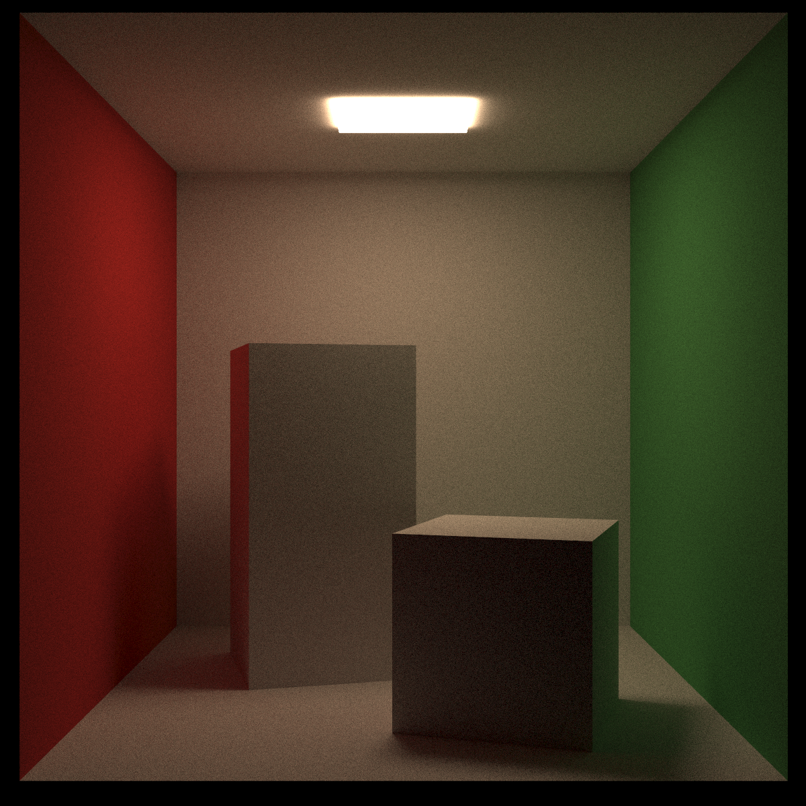
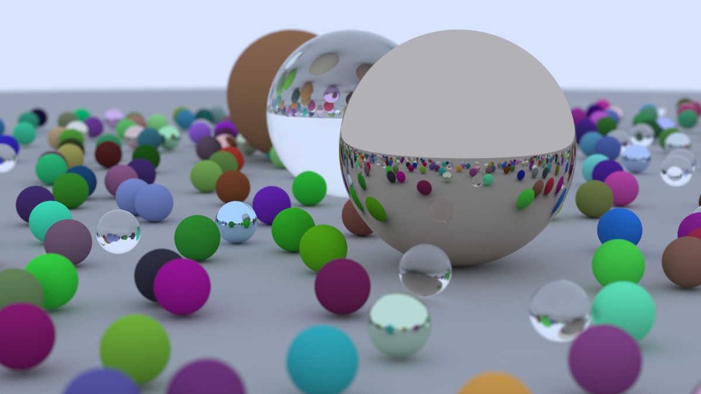

# Raytracer in Rust

This project is an implementation of the classic ["Ray Tracing in One Weekend"](https://raytracing.github.io/books/RayTracingInOneWeekend.html) tutorial, originally written in C++, but rewritten in idiomatic Rust.

## Features

- Modular Rust codebase
- Core raytracing primitives: vectors, rays, spheres, and hittable lists
- Output in PPM image format
- Designed for clarity and extensibility


## Getting Started

1. Install [Rust](https://www.rust-lang.org/tools/install)
2. Run a demo by specifying its name. For example, to run the Cornell Box demo:
   ```sh
   cargo run --release cornell_box
   ```
   Or to run the Spheres demo:
   ```sh
   cargo run --release spheres
   ```

## Goals

- Learn Rust by porting a well-known C++ raytracer
- Write clean, idiomatic, and safe Rust code
- Make it easy to extend with new features and shapes

## Images

Here are some example renders produced by this raytracer:

- Cornell Box:

  

- Spheres:

  

## Running Demos

Ensure you have built the project in release mode for optimal performance.